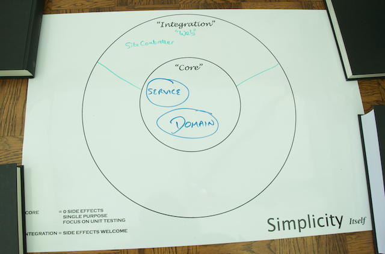
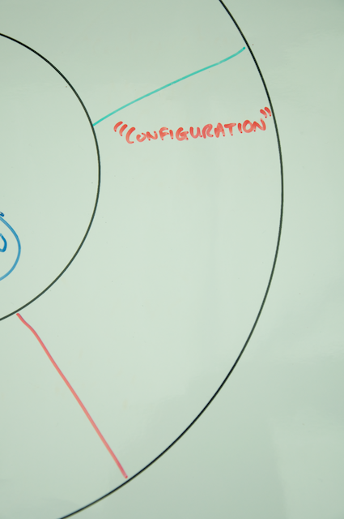
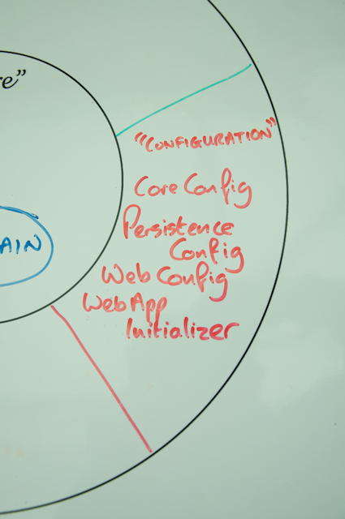

Now that you have [written and tested a web controller](../2/), proudly added to your Life Preserver as shown below, it's time to bring the whole application together.


 
## Step 3: Configuring a basic application

At this point you are ready to:

* Configure the core of your application
* Configure your Web components
* Initialize your infrastructure to create a working WAR file.
* Run your Web application in a web container

To complete these tasks, you'll need a new domain, the Configuration domain.



## Create a configuration for your application's Core and Persistence domains using Spring JavaConfig

The Yummy Noodle Bar application contains a core set of components that include domain classes and services. It also contains an in memory persistence stored integrated with the core.

You could just create a configuration for these components; however, as in the previous step, you'll apply the Test Driven Development approach to your configuration.

### Test your Core and Persistence configurations

First, construct an integration test that contains the following:

    <@snippet path="src/test/java/com/yummynoodlebar/config/CoreDomainIntegrationTest.java" prefix="complete"/>

This integration test constructs an `ApplicationContext` using JavaConfig as specified on the `@ContextConfiguration` annotation. The Core domain's configuration will be created using Spring JavaConfig in a class called `CoreConfig`. The persistence domain's configuration will be created in a class call `PersistenceConfig`.

With the `ApplicationContext` constructed, the test can have its `MenuService` and `OrderService` test entry points autowired, ready for the test methods.

Finally you have two test methods that assert that the `menuService` and `orderService` dependencies has been provided and appear to work correctly.

Next, create the Core and Persistence domain configurations.

### Implement your Core domain configuration

The Core domain configuration for the Yummy Noodle Bar application only contains two services. It relies on the Persistence domain being configured to provide dependencies.

The following code shows the complete configuration class:

 <@snippet path="src/main/java/com/yummynoodlebar/config/CoreConfig.java" prefix="complete"/>
 
The core event handler will dispatch events to the persistence domain, which will perform the actual persistence.  This currently uses a set of HashMaps wrapped by in memory 'repositories'.
 
  <@snippet path="src/main/java/com/yummynoodlebar/config/PersistenceConfig.java" prefix="complete"/>

Spring JavaConfig will detect each `@Bean` annotated method as a method that generates configured Spring Beans.

Running the `CoreDomainIntegrationTest` in the `com.yummynoodlebar.config` test package will verify that your Core Domain configuration is good to go.

## Create a configuration for your Web components

Configuring your new set of controllers is very straightforward as you have used `@Controller` on each of the controller classes. 

To initialize your Web domain's components, all you need to do is turn on component scanning so that Spring can find and initialize these Spring beans.

### Implement your Web domain configuration

You can create the following Spring JavaConfig to execute component scanning for the components in your application's RESTful domain:

    <@snippet path="src/main/java/com/yummynoodlebar/config/WebConfig.java" prefix="complete"/>

The `@ComponentScan` attribute in JavaConfig specifies that your components should be found underneath the base Java package of `com.yummynoodlebar.web.controllers`. 

> **Note:** It's always a good idea to be as specific as possible when defining the place where component scanning should occur so that you don't accidentally initialize components you didn't expect!

### Test your Web domain configuration

No configuration should be trusted without an accompanying test. The following test asserts that the output of the Web configuration is as it should be:

    <@snippet path="src/test/java/com/yummynoodlebar/config/WebDomainIntegrationTest.java" prefix="complete"/>

You've already asserted the correctness of the collaboration between your controllers and the underlying service components in the Core Domain. 

This test ensures that once everything is wired together, the wiring in the `WebConfig` is correct and the appropriate controllers are in attendance.

The test validates the `WebConfig` by mocking requests which exercise the handler mappings. The full responses are also confirmed to be correct. More testing could be done, but you've already asserted that your controllers should work appropriately in the previous steps. This test is simply there to show you that now you are configuring those components using Spring JavaConfig properly.

## Initialize your Web service web infrastructure

As of Spring 3.2, if you're using a web container that supports the Servlet 3 specification such as Tomcat 7+, it's possible to initialize the underlying web infrastructure for your application without writing a single line of XML.

Here you're going to use the `WebApplicationInitializer` to set up your application's web application context parameters to bootstrap your application's web infrastructure as shown in the following code.

First you create a new piece of configuration as a class inside `com.yummynoodlebar.config` called `WebAppInitializer` that extends the `AbstractAnnotationConfigDispatcherServletInitializer` from Spring as shown below.

    <@snippet "src/main/java/com/yummynoodlebar/config/WebAppInitializer.java" "top" "/complete"/>

Next you override the `getRootConfigClasses` method which provides a set of Spring Configuration classes to construct the root application context.  This context will be shared by all elements of the application, including Servlets, Filters and Context Listeners, if present. It will containing the majority of your components, including your Core and Persistence domains.

    <@snippet "src/main/java/com/yummynoodlebar/config/WebAppInitializer.java" "root" "/complete"/>

Now with a root Application Context being initialised, override `getServletConfigClasses`.  This again returns a list of Spring Configuration classes, in this case, just the ones that are used as Servlet delegates.

    <@snippet "src/main/java/com/yummynoodlebar/config/WebAppInitializer.java" "servletContext" "/complete"/>

Lastly, add some extra configuration to map the servlet URL context and add a standard filter.

    <@snippet "src/main/java/com/yummynoodlebar/config/WebAppInitializer.java" "servletConfig" "/complete"/>

`AbstractAnnotationConfigDispatcherServletInitializer` performs setup of the Spring `DispatcherServlet` and `ContextLoader` that are a standard part of Spring web applications.

The `DispatcherServlet` is a 'front controller' servlet that receives all incoming requests that should be considered for the various controllers registered. The DispatcherServlet also orchestrates how each incoming request is channelled to the appropriate handler method on the available controllers.

The full `WebAppInitializer` source code is shown below:

    <@snippet path="src/main/java/com/yummynoodlebar/config/WebAppInitializer.java" prefix="complete"/>


## Running your Web service in a Web Container

It's the moment of truth: can you execute your Web application? 

To find out, first tell Gradle that you will use Tomcat. Update your `build.gradle` file to look like this:

    <@snippet path="build.gradle" prefix="complete"/>

You may notice at the bottom of the build file a setting to ensure the app runs at the root context:

```groovy 
tomcatRunWar.contextPath = ''   
```

Now you can run the following from the command line to execute the new service, on port 8080 by default:

```sh
$ ./gradlew tomcatRunWar
```

Then, if you visit [http://localhost:8080/](http://localhost:8080/), you should get the following plain text response, which is the initial menu populated in `PersistenceConfig`:

```
Yummy Noodles,Special Yummy Noodles,Low cal Yummy Noodles
```

If you need to set your web application to run on a different port or configure other settings, that information is available on the [Gradle Tomcat Plugin](https://github.com/bmuschko/gradle-tomcat-plugin/) project page.

If you plan to execute your service in another container and want to generate a WAR file instead, run the following command:

```sh
$ ./gradlew war
```

## Summary

You've come a long way! You've now got a fully configured Web front end that is running in Tomcat and can be packaged for distribution in a WAR file.

You've added three new components to your Configuration domain, `CoreConfig`, `PersistenceConfig` and `WebConfig` as shown in the updated life preserver below.



Your full Life Preserver should now look like the following:


Your web front end isn't very pretty yet, or even functional.  You will add both a pretty face and expand the number of URLs your application responds to, in the next section of this tutorial

[Next.. Creating rich HTML views using Thymeleaf](../4/)
